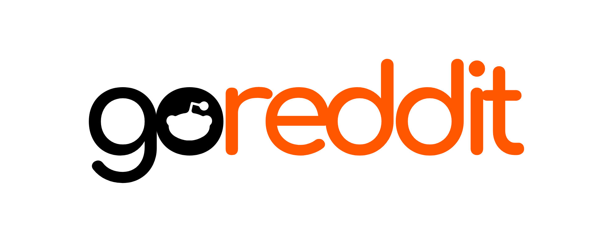

<div align='center'>
<br />


---

<div id='badges' align='center'>

[](https://github.com/vartanbeno/go-reddit/actions)
[](https://goreportcard.com/report/github.com/vartanbeno/go-reddit)
[](https://pkg.go.dev/github.com/vartanbeno/go-reddit/v2/reddit)

</div>

</div>

## Overview

**Featured in issues [327](https://golangweekly.com/issues/327) and [347](https://golangweekly.com/issues/347) of Golang Weekly 🎉**

go-reddit is a Go client library for accessing the Reddit API.

You can view Reddit's official API documentation [here](https://www.reddit.com/dev/api/).

## Install

```sh
go get github.com/vartanbeno/go-reddit/v2
```

The repository structure for managing multiple major versions follows the one outlined [here](https://github.com/go-modules-by-example/index/tree/master/016_major_version_repo_strategy#major-branch-strategy).

## Usage

Make sure to have a Reddit app with a valid client id and secret. [Here](https://github.com/reddit-archive/reddit/wiki/OAuth2-Quick-Start-Example#first-steps) is a quick guide on how to create an app and get credentials.

```go
package main

import "github.com/vartanbeno/go-reddit/v2/reddit"

func main() {
    credentials := reddit.Credentials{ID: "id", Secret: "secret", Username: "username", Password: "password"}
    client, _ := reddit.NewClient(credentials)
}
```

You can pass in a number of options to `NewClient` to further configure the client (see [reddit/reddit-options.go](reddit/reddit-options.go)). For example, to use a custom HTTP client:

```go
httpClient := &http.Client{Timeout: time.Second * 30}
client, _ := reddit.NewClient(credentials, reddit.WithHTTPClient(httpClient))
```

### Read-Only Mode

The `DefaultClient` method returns a valid, read-only client with limited access to the Reddit API, much like a logged out user. You can initialize your own and configure it further using options via `NewReadonlyClient`:

```go
client, _ := reddit.NewReadonlyClient()
```

## Examples

<details>
    <summary>Configure the client from environment variables. When using this option, it's ok to pass an empty struct for the credentials.</summary>

```go
client, _ := reddit.NewClient(reddit.Credentials{}, reddit.FromEnv)
```
</details>

<details>
    <summary>Submit a comment.</summary>

```go
comment, _, err := client.Comment.Submit(context.Background(), "t3_postid", "comment body")
if err != nil {
    return err
}
fmt.Printf("Comment permalink: %s\n", comment.Permalink)
```
</details>

<details>
    <summary>Upvote a post.</summary>

```go
_, err := client.Post.Upvote(context.Background(), "t3_postid")
if err != nil {
    return err
}
```
</details>

<details>
    <summary>Get r/golang's top 5 posts of all time.</summary>

```go
posts, _, err := client.Subreddit.TopPosts(context.Background(), "golang", &reddit.ListPostOptions{
    ListOptions: reddit.ListOptions{
        Limit: 5,
    },
    Time: "all",
})
if err != nil {
    return err
}
fmt.Printf("Received %d posts.\n", len(posts))
```
</details>

More examples are available in the [examples](examples) folder.

## Design

The package design is heavily inspired from [Google's GitHub API client](https://github.com/google/go-github) and [DigitalOcean's API client](https://github.com/digitalocean/godo).

## Contributing

Contributions are welcome! For any bug reports/feature requests, feel free to open an issue or submit a pull request.

## License

This project is licensed under the MIT License - see the [LICENSE](LICENSE) file for details.
